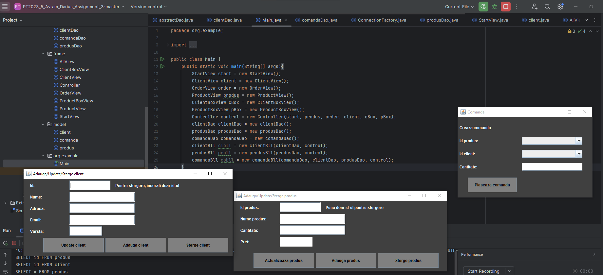

# Warehouse Management Application

## Descriere
Această aplicație gestionează un depozit, folosind o bază de date relațională pentru a stoca informații despre produse, clienți și comenzi. Arhitectura este stratificată și include:
- **Model** – reprezintă entitățile bazei de date.
- **Business Logic (BLL)** – implementează logica aplicației.
- **Data Access (DAO)** – gestionează interacțiunea cu baza de date.
- **GUI** – oferă interfața utilizatorului.
-   
## Screenshot

  
## Structura Proiectului  

### 1. **bll** (Business Logic Layer)
- `ClientsBLL` – gestionează operațiile logice pentru clienți, interacționând cu `ClientsDAO` și GUI.
  
### 2. **connection**
- `ConnectionFactory` – creează conexiunea cu baza de date.  

### 3. **dao** (Data Access Layer)
- `AbstractDAO` – clasă abstractă ce furnizează funcții CRUD comune (`select`, `insert`, `update`, `delete`).
- `ClientsDAO`, `OrdersDAO`, `ProductsDAO` – clase specifice pentru gestionarea entităților.  

### 4. **gui** (Graphical User Interface)
- Clasele din acest pachet sunt responsabile pentru interfața utilizatorului.  

### 5. **model**
- `Clients` – reprezintă modelul de date pentru un client, incluzând metode `getter` și `setter`.

